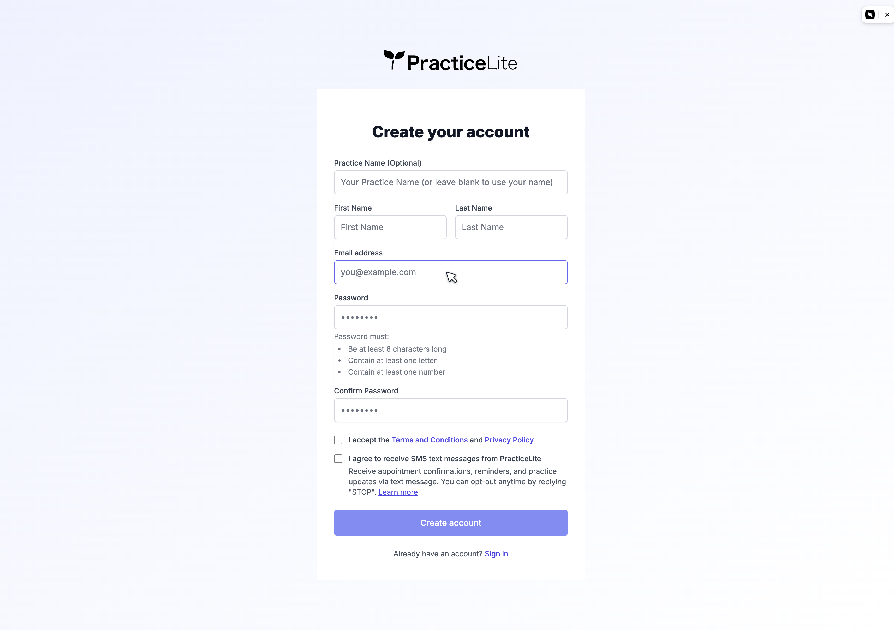
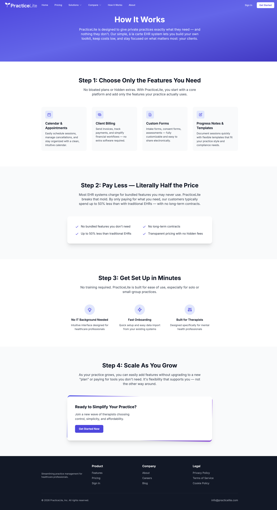

# PracticeLite practice signup and onboarding flow

Research for the eventual redesign of Doula Cloud's own Practice signup. The
question: **what does a purpose-built practice-management competitor already
build into its account-creation flow, so nothing obvious gets missed when
Doula Cloud's onboarding is designed for real?**

Doula Cloud's own signup today is a single unstyled page,
`app/src/routes/signup/+page.svelte`: four fields (practice name, staff name,
email, password), a submit button, and an inline error notice. It posts to
`POST /api/staff/signup` (`api/internal/staffauth/signup.go`), which creates a
Practice, a Staff row, and a full-role Membership in one database transaction.
There is no multi-step wizard, no business-details collection, no plan or
billing selection, no team invites during onboarding, and no verification
step beyond Firebase email/password auth. This document is inspiration only —
it does not propose a design and does not touch `CONTEXT.md`, any ADR, or any
implementation code.

**Method.** Public marketing pages and the live `/signup` form's first screen
only — no trial account was created, no payment info was entered, and no form
was submitted with fabricated data. The site was driven with `/playwriter`
against the user's own Chrome, in its normal light color scheme. A small
Playwriter toolbar badge appears in the top-right corner of the signup
screenshot below; it is an artifact of the capture tooling, not part of
PracticeLite's UI. Every screenshot in
[`practicelite-onboarding-survey/`](practicelite-onboarding-survey/) was
captured from a public page on 28 August 2026, and every claim below is
sourced to the page or screenshot it came from.

## The signup screen — everything PracticeLite asks for

<https://www.practicelite.com/signup>

*Source: `practicelite-signup-step1.png`, captured from
<https://www.practicelite.com/signup>, 28 August 2026.*

There is exactly **one screen**. Every "Get Started" and "Sign Up For Free"
link on the homepage and the pricing page has `href="/signup"` (checked
directly against each anchor's `href` attribute) — there is no interstitial
plan picker or business-details step before the form loads.

| Field | Required? | Notes |
|---|---|---|
| Practice Name | **No** — labelled "Practice Name (Optional)" | Placeholder: *"Your Practice Name (or leave blank to use your name)"* |
| First Name | Implied (unlabelled) | Paired two-column with Last Name |
| Last Name | Implied (unlabelled) | — |
| Email address | Yes | `type="email"`, placeholder `you@example.com` |
| Password | Yes | `type="password"`; placeholder is literally `••••••••` |
| Confirm Password | Yes | Same placeholder |
| "I accept the Terms and Conditions and Privacy Policy" | Yes (checkbox) | Links open `/tos` and `/privacy` in new tabs |
| "I agree to receive SMS text messages from PracticeLite" | **No** (checkbox) | Opt-in, with an explanatory paragraph and a `/sms-consent` "Learn more" link |

Source for the table: the rendered form and its cleaned HTML, both read from
`https://www.practicelite.com/signup` on 28 August 2026.

Nothing on this screen distinguishes "required" fields typographically (no
red asterisk, no "optional" tag on anything but Practice Name) — the
implicit rule is *"required unless the label says otherwise."* An attempt to
click "Create account" with every field empty produced no visible change in
the page's accessibility tree and no navigation, but this is not strong
enough evidence to characterize PracticeLite's client-side validation UX one
way or the other — that avenue was not pursued further, since retrying risked
an accidental real submission.

### Field-level choices worth noting

- **Practice Name defaults to the person, not the business.** The placeholder
  text explicitly tells a solo provider they can skip naming a practice and
  the product will use their own name instead. Doula Cloud's form requires a
  practice name (`required` on `TextInput`,
  `app/src/routes/signup/+page.svelte:60-71`) with no such affordance for a
  solo doula.
- **Name is split into First Name / Last Name**, two columns, paired on one
  row — not the single free-text "Your name" field Doula Cloud collects
  today (`app/src/routes/signup/+page.svelte:72-83`).
- **The password policy is stated inline, not hidden behind a tooltip**: at
  least 8 characters, at least one letter, at least one number — always
  visible under the field, not a hover-triggered explainer. Doula Cloud's
  equivalent is a bare `minlength={6}` HTML attribute with no policy text
  shown to the user at all (`app/src/routes/signup/+page.svelte:97-110`).
- **A Confirm Password field exists.** Doula Cloud's form does not have one.
- **Consent is collected explicitly at signup**, split into two checkboxes:
  a required Terms/Privacy acceptance, and a separate, optional SMS-marketing
  opt-in with plain-language opt-out instructions ("reply STOP"). Doula
  Cloud's signup collects no consent of any kind.

## What's collected up front vs. deferred

The pricing page (<https://www.practicelite.com/pricing>) makes the deferral
explicit: PracticeLite's base plan is **free**, with named paid add-ons
(SMS/Text Notifications $5/mo, Branded Client Portal $3/mo, Premium Support
$5/mo, Note Approvals $6/mo, Advanced Data $5/mo, and several "Coming Soon"
items). None of this — no plan tier, no add-on selection, no payment method —
appears anywhere on the signup form. Billing is entirely a post-signup,
in-app concern; the account is free to create with no card required.

There is also **no team/staff invite step** anywhere in the visible flow, and
**no business-details collection** (address, specialty, license number,
timezone) beyond the optional practice name. Whatever else PracticeLite
collects about a practice, it happens after account creation, inside the
product, where this survey could not follow it without creating a real
account.

## Verification

**No verification step is visible or advertised anywhere in the public
flow.** The form's own copy makes no mention of a confirmation email, phone
verification, or business-license check, and no marketing or pricing page
describes one. This may simply mean PracticeLite emails a confirmation link
after the form is submitted (a pattern this survey could not observe without
creating an account) — but nothing on the public site claims that happens,
and the absence is worth recording plainly rather than assumed away.

## The marketing pitch about onboarding — and the gap it leaves

<https://www.practicelite.com/how-it-works>

*Source: `practicelite-how-it-works.png`, captured from
<https://www.practicelite.com/how-it-works>, 28 August 2026.*

This page is PracticeLite's explicit sales pitch about how onboarding is
structured, in four numbered steps:

> **Step 1: Choose Only the Features You Need.** No bloated plans or hidden
> extras. With PracticeLite, you start with a core platform and add only the
> features your practice actually uses. [Calendar & Appointments, Client
> Billing, Custom Forms, Progress Notes & Templates]
>
> **Step 2: Pay Less — Literally Half the Price.** ... our customers
> typically spend up to 50% less than with traditional EHRs — with no
> long-term contracts.
>
> **Step 3: Get Set Up in Minutes.** No training required. PracticeLite is
> built for ease of use, especially for solo or small-group practices. [No IT
> Background Needed, **Fast Onboarding** — "Quick setup and easy data import
> from your existing systems", Built for Therapists]
>
> **Step 4: Scale As You Grow.** As your practice grows, you can easily add
> features without upgrading to a new "plan" or paying for tools you don't
> need.

The pitch is worth taking at face value as a signal of intent — "get set up
in minutes," no training required, a stated goal of easy data import from a
practice's *existing* system. But **none of Step 1's promised feature
selection appears on the signup form itself.** The form asks for a name,
email, and password — nothing about which of Calendar & Appointments, Client
Billing, Custom Forms, or Progress Notes a practice wants turned on. Either
that selection happens on a later, unobserved in-app screen, or "choose your
features" is a pricing-page framing (features map to paid add-ons, not signup
choices) rather than a step in the account-creation flow proper. This survey
could not resolve which, and does not guess.

## What could not be observed

Recorded plainly, per this survey's rule against fabricating an account to
see further:

- **What happens immediately after "Create account" is clicked.** Does it
  land the new user straight in the product, show a welcome/setup wizard, or
  require email confirmation first? Not observable from public pages.
- **Whether the promised "Choose Only the Features You Need" step exists as
  an actual onboarding screen**, or is realized entirely as post-signup
  billing/settings choices. See the gap noted above.
- **What "easy data import from your existing systems" means in practice** —
  no import UI, wizard, or supported-source list is shown anywhere public.
- **No help center or knowledge base exists for PracticeLite.** Unlike
  Cliniko, SimplePractice, Halaxy, or Clio in the companion survey
  ([`app-shell-and-dense-form-patterns.md`](app-shell-and-dense-form-patterns.md)),
  PracticeLite's footer has no Support/Docs section — only Product, Company,
  and Legal link groups. There is nowhere else public to look for onboarding
  detail beyond the marketing site itself. This thinness is itself a finding,
  consistent with PracticeLite being a very small product: its own homepage
  states "28+ Organizations Signed Up."
- The `/doulas` solutions page (<https://www.practicelite.com/doulas>) was
  also checked for doula-specific onboarding content and has none — it is
  generic feature marketing (birth plan storage, prenatal/postpartum visit
  tracking, doula invoicing) with the same "Sign Up For Free" link to the
  same one-screen form.

## Comparison to Doula Cloud's current signup

| | PracticeLite | Doula Cloud today |
|---|---|---|
| Steps | 1 screen | 1 screen |
| Practice name | Optional, defaults to the person's name | Required |
| Person's name | First Name + Last Name | Single "Your name" field |
| Password policy shown to user | Yes, always visible (8+ chars, 1 letter, 1 number) | No (only `minlength=6`, unstated) |
| Confirm password | Yes | No |
| Terms/Privacy consent | Explicit required checkbox | None |
| Marketing consent | Explicit optional checkbox (SMS) | None |
| Plan/billing selection at signup | None (free base plan; add-ons are post-signup) | N/A (no billing exists yet) |
| Team/staff invites at signup | None observed | None |
| Verification step | None observed or advertised | None (Firebase email/password only) |

The two products land in the same place on step count and on the absence of
a plan-selection or invite step at signup. Where they diverge is in the
smaller, cheaper-to-add details Doula Cloud's MVP form skips entirely:
a stated password policy, a confirm-password field, and any consent capture
at all — none of which require a multi-step wizard to add.

## Sources

Every URL below was fetched on 28 August 2026.

- Signup form — <https://www.practicelite.com/signup>
- How it Works — <https://www.practicelite.com/how-it-works>
- Pricing — <https://www.practicelite.com/pricing>
- Homepage — <https://www.practicelite.com/>
- Doulas solution page — <https://www.practicelite.com/doulas>
- Doula Cloud's current signup: `app/src/routes/signup/+page.svelte`,
  `api/internal/staffauth/signup.go`

